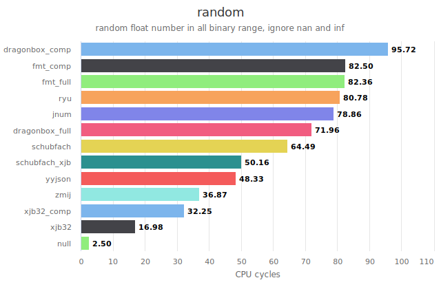
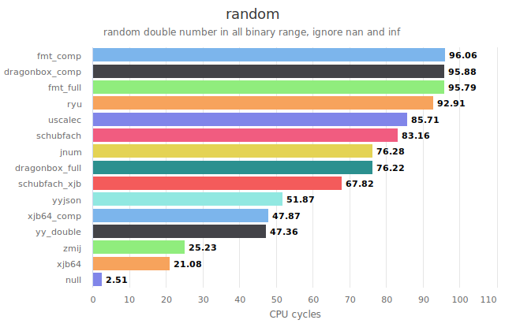

# xjb
xjb : a fast float to string algorithm.

This code is still being updated continuously, so it may not be the final version. Later, I will write documentation to explain in detail the function of each line of code and the proof process.

The document explaining the working principle of the code is called `code_explain.ipynb`.The document is currently under preparation.

the code is still under development and may contain bugs. if you find any bugs, please let me know.  
**warning: The current code can only run on little-endian CPUs. The code for the big-endian CPU is currently under development.**

(1)float/double to decimal algorithm  
&emsp;&emsp;   xjb32 : for float (IEEE754-binary32) ; `xjb32_i.cpp`;  <!-- https://godbolt.org/z/eT57sW9q1   -->  
&emsp;&emsp;   xjb64 : for double(IEEE754-binary64) ; `xjb64_i.cpp`;  <!-- https://godbolt.org/z/oG7eW9jEj   -->

(2)float/double to string algorithm  
&emsp;&emsp;   full lookup table : `dtoa_xjb64_xjb32.cpp` 
&emsp;&emsp;   compress lookup table : `dtoa_xjb_comp.cpp` 

lookup table size:
<table border="1px">
    <tr>
        <td colspan="1"></td>
        <td colspan="1">full table:dtoa_xjb64_xjb32.cpp</td>
        <td colspan="1">compress table:dtoa_xjb_comp.cpp</td>
    </tr>
    <tr>
        <td>float</td>
        <td>1096byte</td>
        <td>64byte</td>
    </tr>
    <tr>
        <td>double</td>
        <td>amd64:15336byte   arm64:15336+256 = 15592byte</td>
        <td>amd64:592byte   arm64:592+256 = 848byte</td>
    </tr>
</table>

Here are a few examples for double to string algorithm:
<table border="1px">
    <tr>
        <td colspan="1">double</td>
        <td colspan="1">print result</td>
    </tr>
    <tr>
        <td>123.45</td>
        <td>"123.45"</td>
    </tr>
    <tr>
        <td>1000</td>
        <td>"1000.0"</td>
    </tr>
    <tr>
        <td>123</td>
        <td>"123.0"</td>
    </tr>
    <tr>
        <td>123000</td>
        <td>"123000.0"</td>
    </tr>
    <tr>
        <td>1.2e23</td>
        <td>"1.2e23"</td>
    </tr>
    <tr>
        <td>1e100</td>
        <td>"1e100"</td>
    </tr>
    <tr>
        <td>0.0123</td>
        <td>"0.0123"</td>
    </tr>
    <tr>
        <td>0.001</td>
        <td>"0.001"</td>
    </tr>
    <tr>
        <td>0.000123</td>
        <td>"1.23e-04"</td>
    </tr>
</table>

<!-- demo link: https://onlinegdb.com/OPKdOpikG -->

This algorithm is based on the schubfach algorithm.
This algorithm is inspired by algorithms such as schubfach, yy, dragonbox, and grisu.

The latest benchmark results:  
to be completed.  

benchmark result on apple M1:

please refer to `bench` directory for more details.  

<!-- https://github.com/xjb714/f2dec_bench

 -->

<!-- 
**Outdated experimental results.**

https://github.com/xjb714/f2dec_bench benchmark result:  
Generate 1e7 random numbers without 0, NaN and Inf. Measure the time spent converting a floating-point number to a decimal result. We conducted tests on the following two processors.  
(1)x86-64  
  
AMD R7 7840H(zen4) ; Ubuntu 24.04.3 LTS ; 24x2=48GB ddr5 5600MHZ;  
clang++: clang 18.1.3  
icpx : icpx 2025.0.4  
g++ : gcc 13.3  

**float:**  
1. g++ -O3 -march=native  
  
1. icpx -O3 -march=native  
  
1. clang++ -O3  -march=native  
  
Under this condition, the xjb32 algorithm will be compiled into AVX-512 code.  
1. clang++ -O3  -march=native -mno-avx512f  
  
Under this condition, the xjb32 algorithm will be compiled into AVX-2 code.  
1. clang++ -O3  -march=native -mno-avx512f -mno-avx2  
  
Under this condition, the xjb32 algorithm will be compiled into normal code.  

**double:**  
1. g++ -O3 -march=native  
  
2. icpx -O3 -march=native  
  
3. clang++ -O3  -march=native  
  
Under this condition, the xjb64 algorithm will be compiled into AVX-512 code.  
4. clang++ -O3  -march=native -mno-avx512f  
  
Under this condition, the xjb64 algorithm will be compiled into AVX-2 code.  
5. clang++ -O3  -march=native -mno-avx512f -mno-avx2  
  
Under this condition, the xjb64 algorithm will be compiled into normal code.  

(2)apple M1  
  
clang++ : Apple clang 17.0.0  
**float:**  
   clang++ -O3 -march=native  
     
**double:**  
   clang++ -O3 -march=native  
     
    -->

<!-- On a little-endian machine, the BCD code y of x, which ranges from 0 to 99, can be calculated as follows. On the big-endian machine, y should be equal to $a  \cdot  256 + b = x - 254 \cdot (x/10)$.
$$
\begin{aligned}
a \cdot 10+b &= x\\
a+b \cdot 256 &= y = a + (x - a \cdot 10)\cdot 256 = x \cdot 256 - (10 \cdot 256 - 1)  \cdot  (x/10)
\end{aligned}
$$

abcdefgh = x
y = a + b<<8 + c<<16 + d<<24 + e<<32 + f<<40 + g<<48 + h<<56

$$
\begin{aligned}
x &= abcdefgh \\
y &= a + (b<<8) + (c<<16) + (d<<24) + (e<<32) + (f<<40) + (g<<48) + (h<<56) \\
y &= a + (b<<8) + (c<<16) + (d<<24) + ((e + (f<<8) + (g<<16) + (h<<24))<<32) \\ 
y &= a + (b<<8) + ((c + (d<<8))<<16) + ((e + (f<<8) + ((g + (h<<8)) << 16))<<32) \\
\end{aligned}
$$

`u64 aabb_ccdd_merge = (x << 32) - ((10000ull<<32) - 1) * ((x * 109951163) >> 40);`
aabb_ccdd_merge = (efgh<<32)+abcd;

`u64 aa_bb_cc_dd_merge = (aabb_ccdd_merge << 16) - ((100ull<<16) - 1) * (((aabb_ccdd_merge * 10486) >> 20) & ((0x7FULL << 32) | 0x7FULL));`
aa_bb_cc_dd_merge = (((gh<<16)+ef)<<32) + ((cd<<16)+ab);

`u64 aabbccdd_BCD = (aa_bb_cc_dd_merge << 8) - ((10ull<<8) - 1) * (((aa_bb_cc_dd_merge * 103) >> 10) & ((0xFULL << 48) | (0xFULL << 32) | (0xFULL << 16) | 0xFULL));`
aabbccdd_BCD = y = a + (b<<8) + ((c + (d<<8))<<16) + ((e + (f<<8) + ((g + (h<<8)) << 16))<<32); -->