# xjb
xjb : a fast float to string algorithm.

(1)float/double to decimal algorithm
   xjb32 : for float (IEEE754-binary32) ; xjb32_i.cpp;  <!-- https://godbolt.org/z/eT57sW9q1   -->
   xjb64 : for double(IEEE754-binary64) ; xjb64_i.cpp;  <!-- https://godbolt.org/z/oG7eW9jEj   -->

(2)float/double to string algorithm
   dtoa_xjb64_xjb32.cpp

<!-- demo link: https://onlinegdb.com/OPKdOpikG -->

This algorithm is based on the schubfach algorithm.
This algorithm is inspired by algorithms such as schubfach, yy, dragonbox, and grisu.

The latest benchmark results:

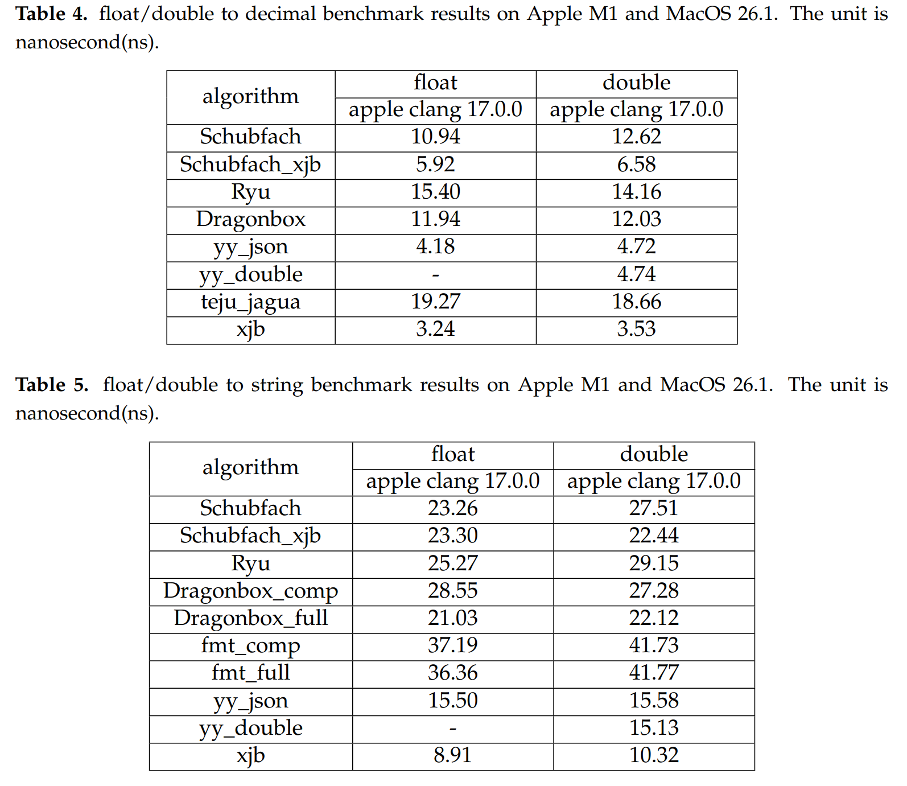

<!-- 
**Outdated experimental results.**

https://github.com/xjb714/f2dec_bench benchmark result:  
Generate 1e7 random numbers without 0, NaN and Inf. Measure the time spent converting a floating-point number to a decimal result. We conducted tests on the following two processors.  
(1)x86-64  
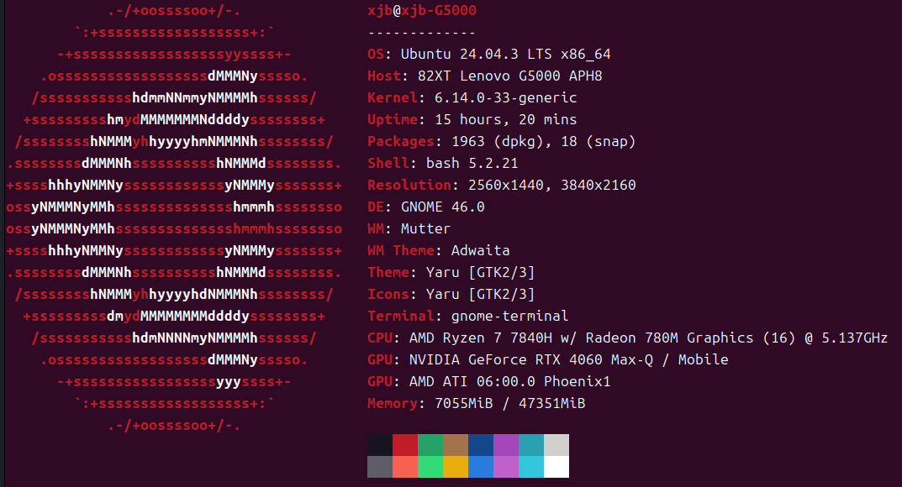  
AMD R7 7840H(zen4) ; Ubuntu 24.04.3 LTS ; 24x2=48GB ddr5 5600MHZ;  
clang++: clang 18.1.3  
icpx : icpx 2025.0.4  
g++ : gcc 13.3  

**float:**  
1. g++ -O3 -march=native  
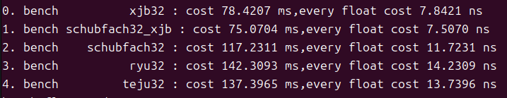  
2. icpx -O3 -march=native  
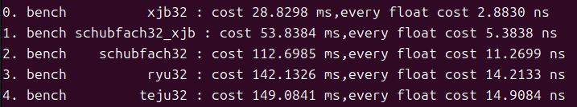  
3. clang++ -O3  -march=native  
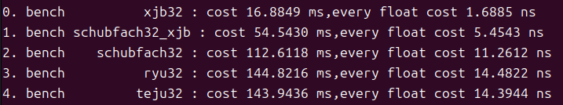  
Under this condition, the xjb32 algorithm will be compiled into AVX-512 code.  
4. clang++ -O3  -march=native -mno-avx512f  
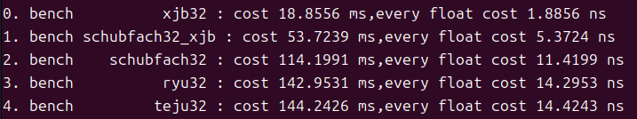  
Under this condition, the xjb32 algorithm will be compiled into AVX-2 code.  
5. clang++ -O3  -march=native -mno-avx512f -mno-avx2  
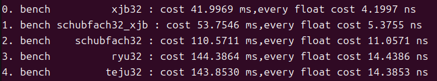  
Under this condition, the xjb32 algorithm will be compiled into normal code.  

**double:**  
1. g++ -O3 -march=native  
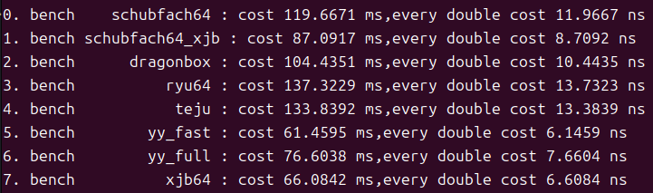  
2. icpx -O3 -march=native  
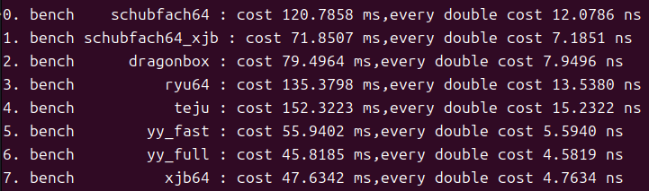  
3. clang++ -O3  -march=native  
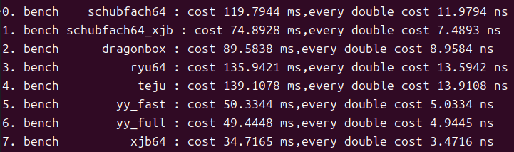  
Under this condition, the xjb64 algorithm will be compiled into AVX-512 code.  
4. clang++ -O3  -march=native -mno-avx512f  
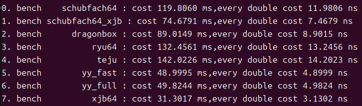  
Under this condition, the xjb64 algorithm will be compiled into AVX-2 code.  
5. clang++ -O3  -march=native -mno-avx512f -mno-avx2  
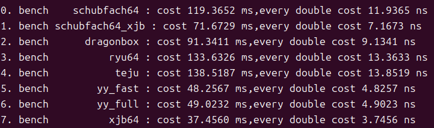  
Under this condition, the xjb64 algorithm will be compiled into normal code.  

(2)apple M1  
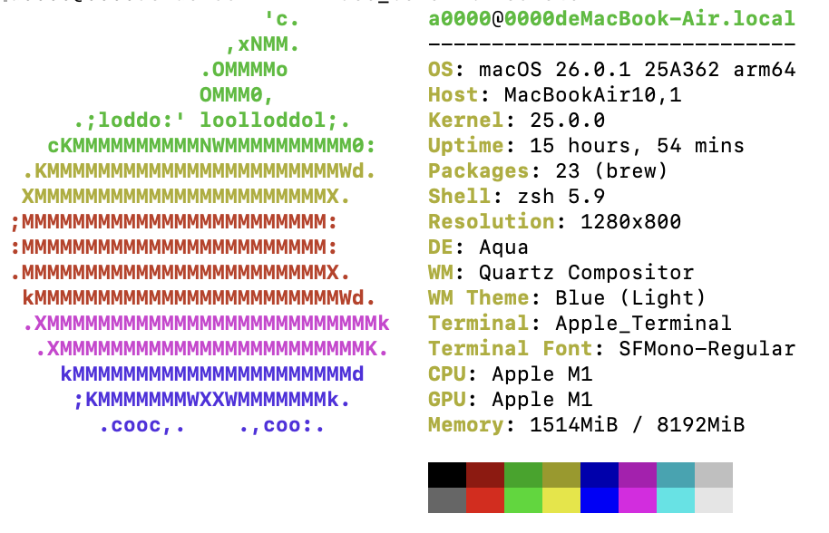  
clang++ : Apple clang 17.0.0  
**float:**  
   clang++ -O3 -march=native  
   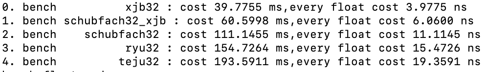  
**double:**  
   clang++ -O3 -march=native  
   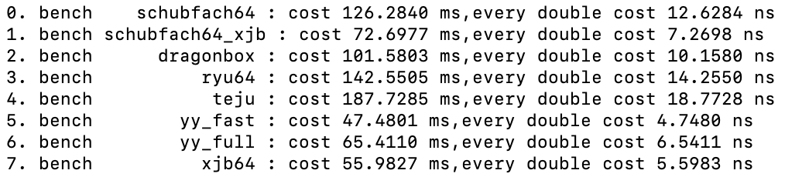  
    -->