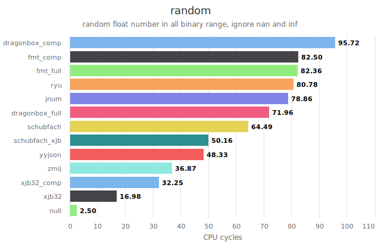
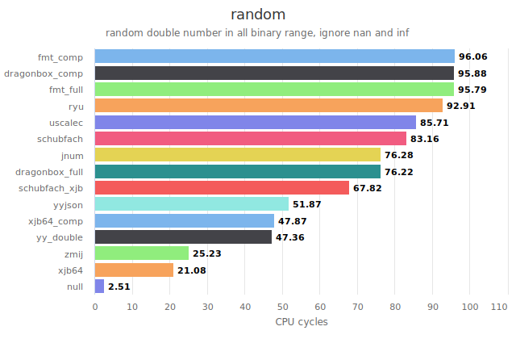
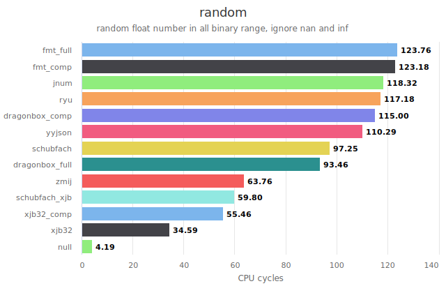
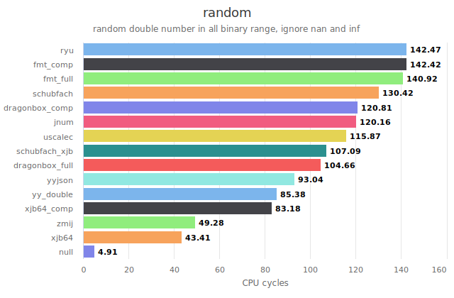

# xjb
xjb : a fast float to string algorithm.

float/double to string single file implementation : `src/ftoa.cpp`

for json lib, satisfy  `RFC8259` or https://tc39.es/ecma262/#sec-numeric-types-number-tostring : `src/ftoa_json.cpp`

This code is still being updated continuously, so it may not be the final version. Later, I will write documentation to explain in detail the function of each line of code and the proof process.

## algorithm correctness proof:  
Execute the following command to verify the correctness of the algorithm.
```
cd bench
make check
```

## todo:
(1) big-endian support
(2) f16, f128 and f256 support

## src files:
(1)float/double to decimal algorithm  
&emsp;&emsp;   xjb32 : for float (IEEE754-binary32) ; `bench/xjb/xjb32_i.cpp`;  <!-- https://godbolt.org/z/eT57sW9q1   -->  
&emsp;&emsp;   xjb64 : for double(IEEE754-binary64) ; `bench/xjb/xjb64_i.cpp`;  <!-- https://godbolt.org/z/oG7eW9jEj   -->

(2)float/double to string algorithm  
&emsp;&emsp;   full lookup table : `bench/xjb/ftoa.cpp` 
&emsp;&emsp;   compress lookup table : `bench/xjb/xjb_comp.cpp`

lookup table size:
<table border="1px">
    <tr>
        <td colspan="1"></td>
        <td colspan="1">full table:ftoa.cpp</td>
        <td colspan="1">compress table:xjb_comp.cpp</td>
    </tr>
    <tr>
        <td>float</td>
        <td>1352 byte</td>
        <td>64 byte</td>
    </tr>
    <tr>
        <td>double</td>
        <td>15336 byte</td>
        <td>592 byte</td>
    </tr>
</table>

## examples:
Here are a few examples for double to string algorithm:
<table border="1px">
    <tr>
        <td colspan="1">double</td>
        <td colspan="1">print result</td>
    </tr>
    <tr>
        <td>123.45</td>
        <td>"123.45"</td>
    </tr>
    <tr>
        <td>1000</td>
        <td>"1000.0"</td>
    </tr>
    <tr>
        <td>123</td>
        <td>"123.0"</td>
    </tr>
    <tr>
        <td>123000</td>
        <td>"123000.0"</td>
    </tr>
    <tr>
        <td>1.2e23</td>
        <td>"1.2e23"</td>
    </tr>
    <tr>
        <td>1e100</td>
        <td>"1e100"</td>
    </tr>
    <tr>
        <td>0.0123</td>
        <td>"0.0123"</td>
    </tr>
    <tr>
        <td>0.001</td>
        <td>"0.001"</td>
    </tr>
    <tr>
        <td>0.000123</td>
        <td>"0.000123"</td>
    </tr>
        <tr>
        <td>1.2e-08</td>
        <td>"1.2e-08"</td>
    </tr>
    <tr>
        <td>0</td>
        <td>"0.0"</td>
    </tr>
    <tr>
        <td>NaN</td>
        <td>"nan"</td>
    </tr>
    <tr>
        <td>Inf</td>
        <td>"inf"</td>
    </tr>
</table>

<!-- demo link: https://onlinegdb.com/OPKdOpikG -->

## Algorithm characteristics:  
This algorithm is based on the schubfach algorithm.  
This algorithm is inspired by algorithms such as schubfach, yy, dragonbox, and grisu.  
(1) Support double and float  
(2) Algorithm process optimization  
(3) Low branch prediction failure rate  
(4) Acceleration using SIMD instruction set  
(5) Low instruction dependency, high IPC  
(6) Fewer instructions  

## benchmark:
The benchmark test is in the `bench` directory. just run `make` to build the benchmark program.
you can run `bench/main.cpp` to test the performance of the algorithm.  
The latest benchmark results on Apple M1 and AMD R7-7840H CPU(date : 2026.2.18):
<!-- 


 -->
<table>
    <tr>
        <td ><center>ramdom float on Apple M1 </br> compiler: apple clang 17.0.0</center></td>
        <td ><center>ramdom double on Apple M1</br> compiler: apple clang 17.0.0</center></td>
    </tr>
    <tr>
        <td><center>ramdom float on AMD R7-7840H </br> compiler: icpx 2025.0.4</center></td>
        <td ><center>ramdom double on AMD R7-7840H</br> compiler: icpx 2025.0.4</center> </td>
    </tr>
</table>

please refer to `bench` directory for more details.  

## related algorithm

algorithm     | Description
--------------|-----------
[schubfach](https://github.com/abolz/Drachennest) | Raffaello Giulietti's algorithm.Origin source code from https://github.com/c4f7fcce9cb06515/Schubfach
schubfach_xjb  | It is improved by schubfach and has the same output result.
[ryu](https://github.com/ulfjack/ryu) | Ulf Adams's [Ryū algorithm](https://dl.acm.org/citation.cfm?id=3192369).
[dragonbox](https://github.com/jk-jeon/dragonbox) | Junekey Jeon's CPP implementation.
[fmt](https://github.com/fmtlib/fmt) | Victor Zverovich.https://github.com/fmtlib/fmt. version:12.1.0
[yy_double](https://github.com/ibireme/c_numconv_benchmark) | yy's algorithm ,  origin link : https://github.com/ibireme/c_numconv_benchmark/blob/master/vendor/yy_double/yy_double.c
[yy_json](https://github.com/ibireme/yyjson) | yy's algorithm. https://github.com/ibireme/yyjson
[teju](https://github.com/cassioneri/teju_jagua) | youtube  link : https://www.youtube.com/watch?v=fPZ1ZdA7Iwc . An academic paper will be written to provide proof of correctness.https://github.com/cassioneri/teju_jagua
[xjb](https://github.com/xjb714/xjb) | XiangJunBo's algorithm. https://github.com/xjb714/xjb
[schubfach_vitaut](https://github.com/vitaut/schubfach) | Vitaut's algorithm. https://github.com/vitaut/schubfach
[zmij](https://github.com/vitaut/zmij) | Vitaut's algorithm. https://github.com/vitaut/zmij
[jnum](https://github.com/lengjingzju/json/blob/master/jnum.c) | Jing Leng's algorithm. https://github.com/lengjingzju/json/blob/master/jnum.c
[uscale](https://github.com/rsc/fpfmt) | Russ Cox's algorithm. src: https://github.com/rsc/fpfmt commit 6255750 (19 Jan 2026). introduction: https://research.swtch.com/fp

## acknowledgement:
Thanks to the following authors:

* Yaoyuan Guo ([@ibireme](https://github.com/ibireme)) - Author of the yyjson and yy_double algorithm , provide benchmark data and test code. The code inspiration for this project comes from the yy algorithm.

* Dougall Johnson ([@dougallj](https://github.com/dougallj)) - Authored the NEON implementation, which is used in the xjb algorithm.

* Daniel Lemire ([@lemire](https://github.com/lerime)) - Authored the AVX512IFMA implementation(Convert 8/16 digit integer to decimal strings), which is used in the xjb algorithm. [code](https://lemire.me/blog/2022/03/28/converting-integers-to-decimal-strings-faster-with-avx-512/)

* Raffaello Giulietti ([@rgiulietti](https://github.com/rgiulietti)) - Author of the Schubfach algorithm, whose work forms a foundational basis for xjb.


## who is using this algorithm

- [ssrJSON](https://github.com/Antares0982/ssrJSON) - A SIMD boosted high-performance and correct Python JSON parsing library, faster than the fastest.
- [jsoniter-scala](https://github.com/plokhotnyuk/jsoniter-scala) - Scala macros for compile-time generation of safe and ultra-fast JSON codecs + circe booster.