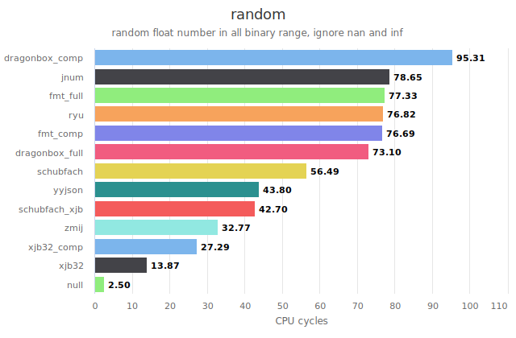
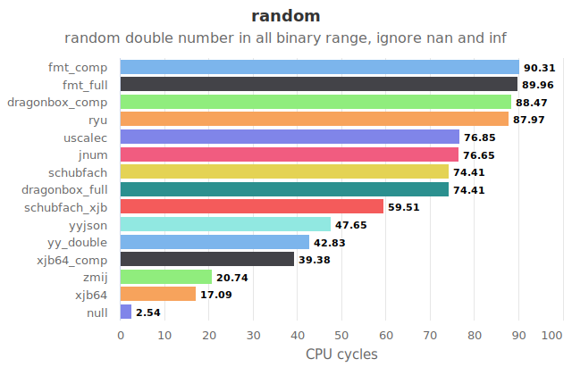
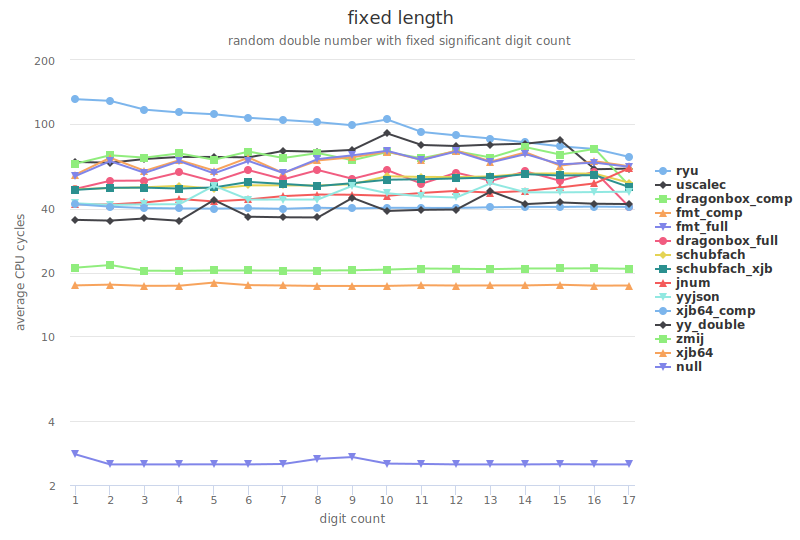
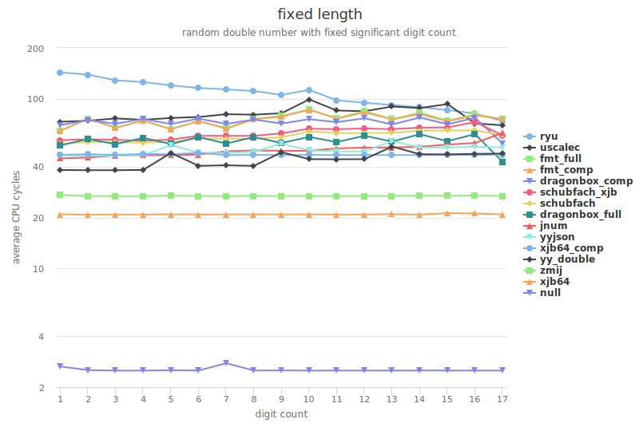
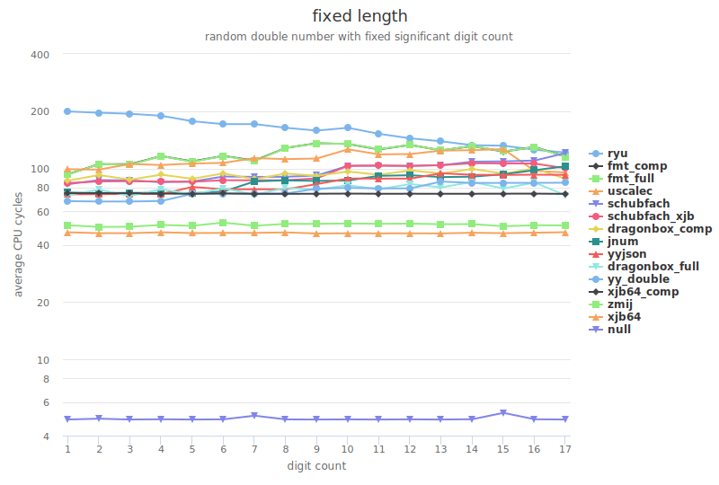

# xjb: Fast Float to String Algorithm

xjb is a high-performance algorithm for converting floating-point numbers (float/double) to strings, designed for speed and correctness. It provides single-file implementations for both general use and JSON-specific formatting.

## Background

In the field of floating-point number printing, Steele & White established several key principles in their seminal paper "How to Print Floating-Point Numbers Accurately":

1. **Information Preservation**: The conversion must produce a decimal string that, when parsed back, yields the original floating-point number or the closest possible value.
2. **Shortest Representation**: Use the minimal number of digits necessary to uniquely identify the floating-point number.
3. **Proper Rounding**: When multiple representations are equally valid, choose the one that rounds correctly.

## 1. Key Features

- **High Performance**: Optimized algorithm with low branch prediction failure rate and SIMD acceleration
- **Correctness**: Satisfies `RFC8259` and ECMAScript standards for JSON number formatting
- **Small Footprint**: Compact lookup tables for both float and double conversions
- **Versatility**: Support for both float (IEEE754-binary32) and double (IEEE754-binary64) types
- **Modern Design**: Low instruction dependency and high IPC (Instructions Per Cycle)

## 2. Implementation Files

### 2.1 Core Implementations
- **General float/double to string**: `src/ftoa.cpp`
- **JSON-specific formatting**: `src/ftoa_json.cpp` (satisfies RFC8259 and ECMAScript standards)

### 2.2 Algorithm Variants

#### Float to Decimal Conversion Algorithms
- **xjb32**: For float (IEEE754-binary32) - `bench/xjb/float_to_decimal/xjb32_i.cpp`
- **xjb64**: For double (IEEE754-binary64) - `bench/xjb/float_to_decimal/xjb64_i.cpp`

#### Float to String Conversion Algorithms
- **Full lookup table**: `bench/xjb/float_to_string/ftoa.cpp`
- **Compressed lookup table**: `bench/xjb/float_to_string/ftoa_comp.cpp`

### 2.3 Lookup Table Sizes

| Type    | Full Table (ftoa.cpp) | Compressed Table (ftoa_comp.cpp) |
|---------|----------------------|-----------------------------------|
| float   | 1352 bytes           | 64 bytes                          |
| double  | 15336 bytes          | 368 bytes                         |

## 3. Usage Examples

Here are some examples of how the double to string algorithm handles various inputs:

| Input     | Output       |
|-----------|--------------|
| 123.45    | "123.45"     |
| 1000      | "1000.0"     |
| 123       | "123.0"      |
| 123000    | "123000.0"   |
| 1.2e23    | "1.2e23"     |
| 1e100     | "1e100"      |
| 0.0123    | "0.0123"     |
| 0.001     | "0.001"      |
| 0.000123  | "0.000123"   |
| 1.2e-08   | "1.2e-08"    |
| 0         | "0.0"        |
| NaN       | "nan"        |
| Inf       | "inf"        |

## 4. Algorithm Characteristics

xjb is based on the schubfach algorithm and inspired by other state-of-the-art algorithms like yy, dragonbox, and grisu. Key characteristics include:

1. **Dual Precision Support**: Handles both float and double types
2. **Optimized Process**: Streamlined algorithm flow for maximum performance
3. **Low Branch Misprediction**: Designed to minimize pipeline stalls
4. **SIMD Acceleration**: Leverages SIMD instruction sets for faster processing
5. **High Instruction Level Parallelism**: Low dependency between instructions
6. **Efficient Instruction Count**: Minimizes the number of operations

## 5. Algorithm Principle

The following algorithmic process is derived from a variant of the Schubfach algorithm.

------
### algorithm : The xjb Algorithm for Float-to-Decimal Conversion

**Input**   : $c,q$ ; Floating-point components  $c$  (significand) and  $q$  (exponent)  
**Output**  : $d,k$ ; Decimal representation  $d \cdot 10^k$  satisfying the SW principle

1.  $c \cdot 2^q \gets v$ 
2.  $\text{if } v \text{ is regular}$ 
3.  $\quad k \gets \lfloor q \cdot \log_{10}(2) \rfloor$ 
4.  $\text{else}$ 
5.  $\quad k \gets \lfloor q \cdot \log_{10}(2) - \log_{10}(4/3) \rfloor$ 
6.  $\text{end if}$ 
7.  $m \gets \lfloor v \cdot 10^{-k-1} \rfloor$ 
8.  $n \gets v \cdot 10^{-k-1} - m$ 
9.  $ten \gets 10m$ 
10.  $\delta \gets 10n - \lfloor 10n \rfloor$  // fractional part of  $10n$ 
11.  $\text{if } \delta = 0.5$ 
12.  $\quad \text{if } \lfloor 10n \rfloor \bmod 2 = 0$ 
13.  $\quad\quad one \gets \lfloor 10n \rfloor$  // round to even
14.  $\quad \text{else}$ 
15.  $\quad\quad one \gets \lfloor 10n \rfloor + 1$ 
16.  $\quad \text{end if}$ 
17.  $\text{elif } \delta < 0.5$ 
18.  $\quad one \gets \lfloor 10n \rfloor$  // round to nearest
19.  $\text{else}$ 
20.  $\quad one \gets \lfloor 10n \rfloor + 1$  // round to nearest
21.  $\text{end if}$ 
22.  $\text{if } v \text{ is irregular}$ 
23.  $\quad \text{if } \delta > 2^{q-2} \cdot 10^{-k}$ 
24.  $\quad\quad one \gets \lfloor 10n \rfloor + 1$ 
25.  $\quad \text{end if}$ 
26.  $\quad \text{if } 2^{q-2} \cdot 10^{-k-1} \geq n$ 
27.  $\quad\quad one \gets 0$ 
28.  $\quad \text{end if}$ 
29.  $\text{else}$ 
30.  $\quad \text{if } 2^{q-1} \cdot 10^{-k-1} > n \text{ or } \left( 2^{q-1} \cdot 10^{-k-1} = n \text{ and } c \bmod 2 = 0 \right)$ 
31.  $\quad\quad one \gets 0$  // minimum length
32.  $\quad \text{end if}$ 
33.  $\text{end if}$ 
34.  $\text{if } 2^{q-1} \cdot 10^{-k-1} > 1-n \text{ or } \left( 2^{q-1} \cdot 10^{-k-1} = 1-n \text{ and } c \bmod 2 = 0 \right)$ 
35.  $\quad one \gets 10$  // minimum length
36.  $\text{end if}$ 
37.  $d \gets ten + one$  // information preservation
38.  $\text{return } d, k$ 
---

Algorithm Principle Introduction Document : [xjb](xjb.pdf)  
Note : There is a mistake in Algorithm 1 on page 10 of the article. Please refer to the above implementation.

Our algorithm produced the same output results as the Schubfach algorithm.
To verify the correctness of the algorithm, run the following command:

```bash
cd bench
make check
```

## 6. Benchmark Results

Benchmark tests are located in the `bench` directory. Build the benchmark program with `make` and run `bench/main.cpp` to test performance.

Latest benchmark results (as of 2026.4.13 v1.5.0) on various CPUs:

<table>
on Apple M5:
    <tr>
        <td ><center>ramdom float on Apple M5 </br> compiler: apple clang 21.0.0</center></td>
        <td ><center>ramdom double on Apple M5</br> compiler: apple clang 21.0.0</center></td>
        <td><center>fixed-length double on Apple M5 </br> compiler: apple clang 21.0.0</center></td>
    </tr>
</table>
<table>
on Apple M1:
    <tr>
        <td ><center>ramdom float on Apple M1 </br> compiler: apple clang 21.0.0</center></td>
        <td ><center>ramdom double on Apple M1</br> compiler: apple clang 21.0.0</center></td>
        <td><center>fixed-length double on Apple M1 </br> compiler: apple clang 21.0.0</center></td>
    </tr>
</table>
<table>
on AMD R7-7840H:
    <tr>
        <td><center>ramdom float on AMD R7-7840H </br> compiler: icpx 2025.0.4</center></td>
        <td ><center>ramdom double on AMD R7-7840H</br> compiler: icpx 2025.0.4</center> </td>
        <td ><center>fixed-length double on AMD R7-7840H</br> compiler: icpx 2025.0.4</center> </td>
    </tr>
    </tr>
</table>

For detailed benchmark results and charts, please refer to the `bench` directory.

## 7. Related Algorithms

| Algorithm               | Description                                                                 |
|-------------------------|-----------------------------------------------------------------------------|
| [schubfach](https://github.com/abolz/Drachennest) | Raffaello Giulietti's algorithm. Original source: https://github.com/c4f7fcce9cb06515/Schubfach |
| schubfach_xjb           | Improved version of schubfach with identical output results                 |
| [ryu](https://github.com/ulfjack/ryu) | Ulf Adams's [Ryū algorithm](https://dl.acm.org/citation.cfm?id=3192369)     |
| [dragonbox](https://github.com/jk-jeon/dragonbox) | Junekey Jeon's C++ implementation                                          |
| [fmt](https://github.com/fmtlib/fmt) | Victor Zverovich's formatting library (version: 12.1.0)                    |
| [yy_double](https://github.com/ibireme/c_numconv_benchmark) | yy's algorithm from https://github.com/ibireme/c_numconv_benchmark/blob/master/vendor/yy_double/yy_double.c |
| [yy_json](https://github.com/ibireme/yyjson) | yy's algorithm for JSON                                                    |
| [teju](https://github.com/cassioneri/teju_jagua) | Algorithm with upcoming academic paper for correctness proof               |
| [xjb](https://github.com/xjb714/xjb) | XiangJunBo's algorithm (this project)                                      |
| [schubfach_vitaut](https://github.com/vitaut/schubfach) | Vitaut's implementation of schubfach                                      |
| [zmij](https://github.com/vitaut/zmij) | Vitaut's algorithm                                                         |
| [jnum](https://github.com/lengjingzju/json/blob/master/jnum.c) | Jing Leng's algorithm                                                     |
| [uscale](https://github.com/rsc/fpfmt) | Russ Cox's algorithm ,[document](https://research.swtch.com/fp)                  |

## 8. Acknowledgements

Special thanks to the following contributors and inspirations:

- **Yaoyuan Guo** ([@ibireme](https://github.com/ibireme)) - Author of yyjson and yy_double algorithms, provided benchmark data and test code. This project was inspired by the yy algorithm.

- **Dougall Johnson** ([@dougallj](https://github.com/dougallj)) - Authored the NEON implementation used in xjb.

- **Daniel Lemire** ([@lemire](https://github.com/lemire)) - Authored the AVX512IFMA implementation for converting integers to decimal strings, used in xjb.

- **Raffaello Giulietti** ([@rgiulietti](https://github.com/rgiulietti)) - Author of the Schubfach algorithm, which forms the foundation of xjb.

- **Victor Zverovich** ([@vitaut](https://github.com/vitaut)) - Author of the zmij algorithm and fmt library. Parts of this implementation are derived from zmij.

## 9. Projects Using xjb

- [ssrJSON](https://github.com/Antares0982/ssrJSON) - A SIMD-boosted high-performance Python JSON parsing library
- [jsoniter-scala](https://github.com/plokhotnyuk/jsoniter-scala) - Scala macros for compile-time generation of fast JSON codecs

## 10. Roadmap

- [ ] Big-endian support
- [x] f16 support
- [x] f32 support
- [x] f64 support
- [ ] f80 support
- [ ] f128 support
- [ ] f256 support

## 11. Contributing

Contributions are welcome! Please feel free to submit issues or pull requests to help improve this project.

## 12. License

[MIT License](LICENSE)