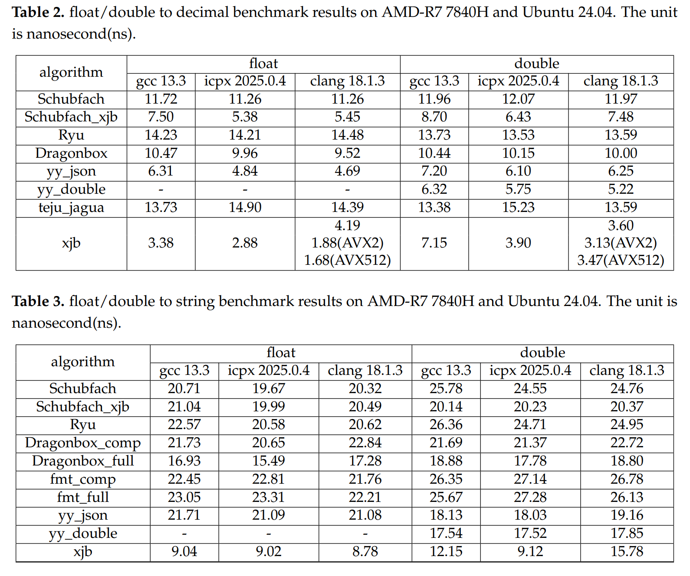

a simple demo for bench float/double to decimal and string algorithm.

algorithm     | Description
--------------|-----------
[schubfach](https://github.com/abolz/Drachennest) | Raffaello Giulietti's algorithm.Origin source code from https://github.com/c4f7fcce9cb06515/Schubfach
schubfach_xjb  | It is improved by schubfach and has the same output result.
[ryu](https://github.com/ulfjack/ryu) | Ulf Adams's [Ryū algorithm](https://dl.acm.org/citation.cfm?id=3192369).
[dragonbox](https://github.com/jk-jeon/dragonbox) | Junekey Jeon's CPP implementation.
[fmt](https://github.com/fmtlib/fmt) | Victor Zverovich.https://github.com/fmtlib/fmt. version:12.1.0
[yy_double](https://github.com/ibireme/c_numconv_benchmark) | yy's algorithm ,  origin link : https://github.com/ibireme/c_numconv_benchmark/blob/master/vendor/yy_double/yy_double.c
[yy_json](https://github.com/ibireme/yyjson) | yy's algorithm. https://github.com/ibireme/yyjson
[teju](https://github.com/cassioneri/teju_jagua) | youtube  link : https://www.youtube.com/watch?v=fPZ1ZdA7Iwc . An academic paper will be written to provide proof of correctness.https://github.com/cassioneri/teju_jagua
[xjb](https://github.com/xjb714/xjb) | XiangJunBo's algorithm. https://github.com/xjb714/xjb

(1) run :  
makefile variable settings:
&emsp;    float/double to decimal : set variable BENCH_F_TO_STR = 0  
&emsp;    float/double to string  : set variable BENCH_F_TO_STR = 1  
&emsp;    benchmark double        : set variable BENCH_DOUBLE = 1  
&emsp;    benchmark float         : set variable BENCH_DOUBLE = 0  
compile and exec :  
&emsp;    gcc: `make g` or `make`
&emsp;    icpx:`make i`
&emsp;    clang:`make c`

(2) benchmark results :
``CPU : AMD R7 7840H , OS : ubuntu 24.04``
``compiler : (1)gcc13.3 (2)icpx 2025.0.4 (3)clang 18.1.3 ``

``CPU : Apple M1 , OS : MacOS 26.1``
``compiler : apple clang 17.0.0 ``

<!-- double:

float:
 -->

author : Xiang Jun Bo (xjb) , China , email : 1302035400@qq.com
date : 2025.5.13